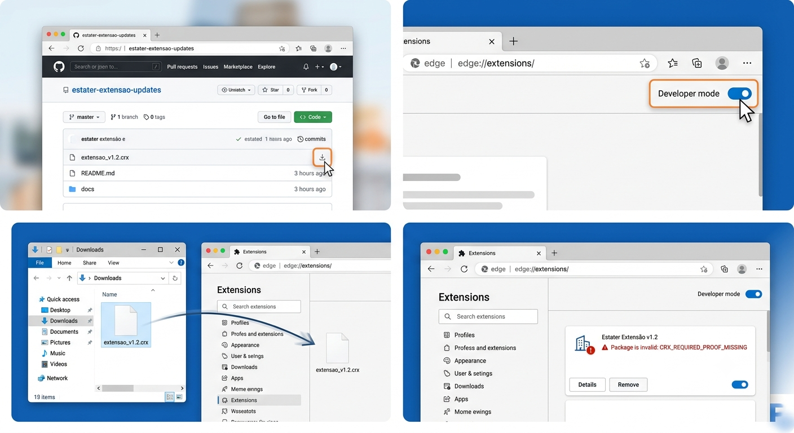

# 📦 Estater - Distribuição da Extensão

Bem-vindo ao repositório de distribuição da extensão **Estater**. 
Este repositório é dedicado a hospedar as versões mais recentes (arquivos `.crx`) e o arquivo de controle de atualizações.

Como a nossa extensão é desenvolvida para uso específico e distribuída fora da Google Chrome Web Store, elaboramos este guia para ajudar você a baixar e instalar a ferramenta.

## ⬇️ Como Baixar a Extensão

Se você não está familiarizado com o GitHub, não se preocupe! Você tem duas opções para baixar a extensão:

### Opção 1: Baixar apenas o arquivo da extensão (Recomendado)
Clique no link abaixo para baixar diretamente a versão mais recente para o seu computador:
👉 **[Baixar extensao_v1.2.crx](https://github.com/gabriel-fsantana/estater-extensao-updates/raw/main/extensao_v1.2.crx)**

### Opção 2: Baixar todo este repositório (Formato ZIP)
Se preferir baixar todos os arquivos (incluindo manuais):
1. [Clique aqui para baixar o ZIP do repositório](https://github.com/gabriel-fsantana/estater-extensao-updates/archive/refs/heads/main.zip).
2. Extraia o arquivo `.zip` no seu computador.
3. Dentro da pasta extraída, você encontrará o arquivo `extensao_v1.2.crx`.

---

## 📚 Como Instalar?

Após realizar o download usando um dos métodos acima, escolha o guia de instalação:

- [📖 Guia de Instalação Passo a Passo](docs/GUIA_DE_INSTALACAO.md) - **Leia isto para instalar a extensão no seu navegador.**
- [🛠️ Solução de Problemas Comuns](docs/SOLUCAO_DE_PROBLEMAS.md) - Consulte se encontrar erros de bloqueio.
